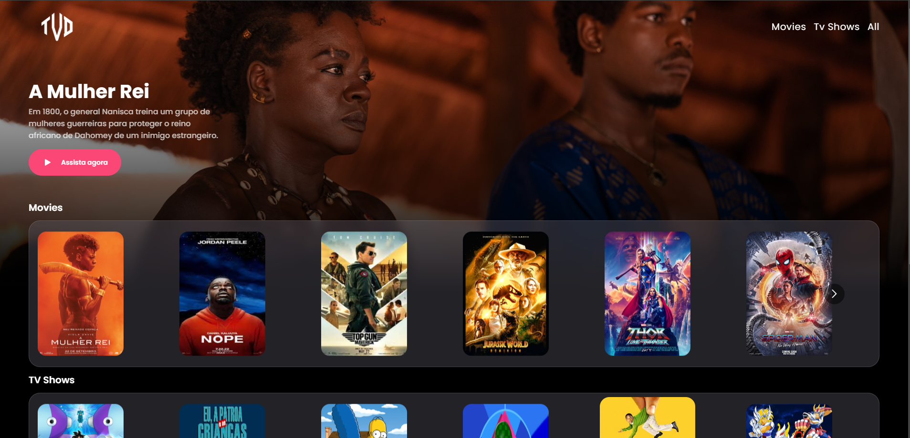
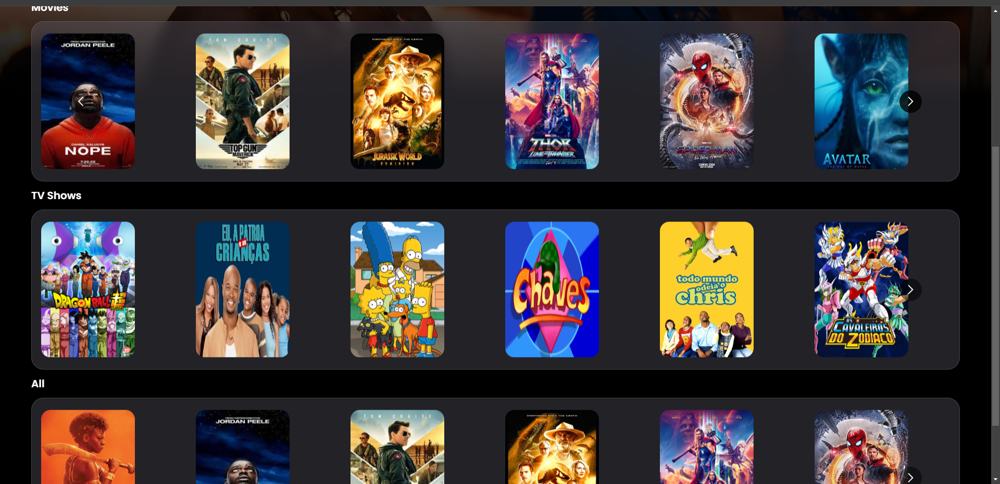

# React + Vite | Movie App

Breve descrição das dependências utilizadas:

``@vime/core``
Um conjunto de componentes web para construir players de mídia personalizados e responsivos. Oferece suporte a várias plataformas de mídia, como vídeos, áudio e transmissão ao vivo.

``@vime/react``
Um pacote de integração do @vime/core para React, permitindo que você utilize os componentes do Vime em aplicativos React de maneira fácil e nativa.

``react-dom``
Uma biblioteca do React responsável por manipular o DOM no navegador. Ela lida com a renderização de componentes React na página.

``react-icons``
Uma biblioteca que fornece uma coleção de ícones populares em formato de componentes React. Facilita a adição de ícones de diferentes bibliotecas, como Font Awesome, Material Design e outros.

``react-multi-carousel``
Um componente de carrossel personalizável para React que permite criar sliders de conteúdo, como imagens ou cards, com várias opções de configuração e responsividade.

``styled-components``
Uma biblioteca que permite escrever estilos CSS diretamente dentro dos componentes React utilizando a sintaxe de template literals do JavaScript. Facilita a criação de estilos dinâmicos e modulares.

